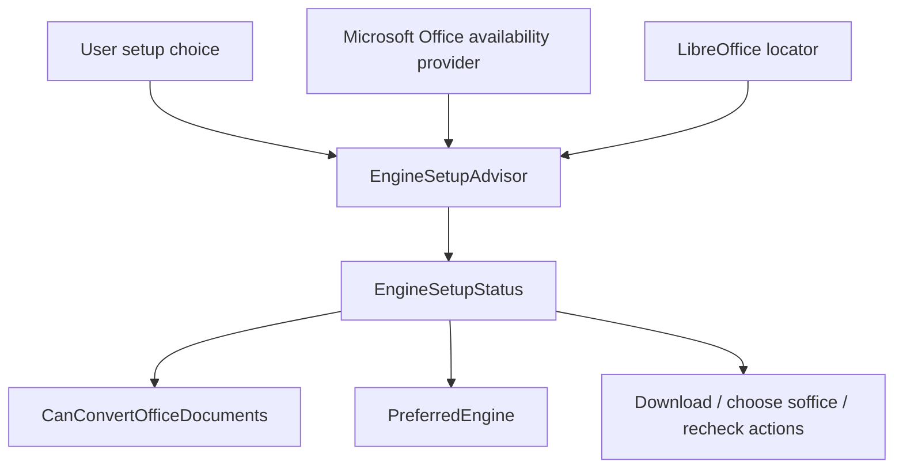
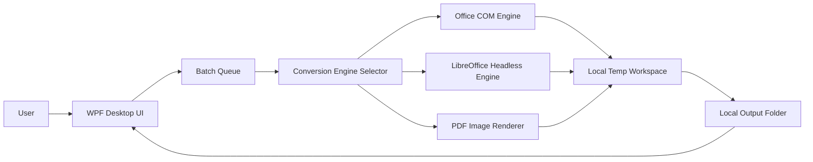
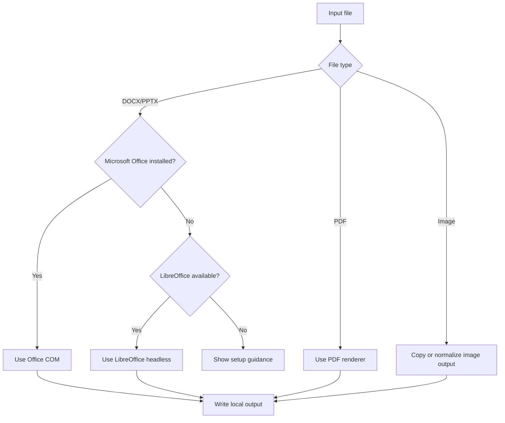
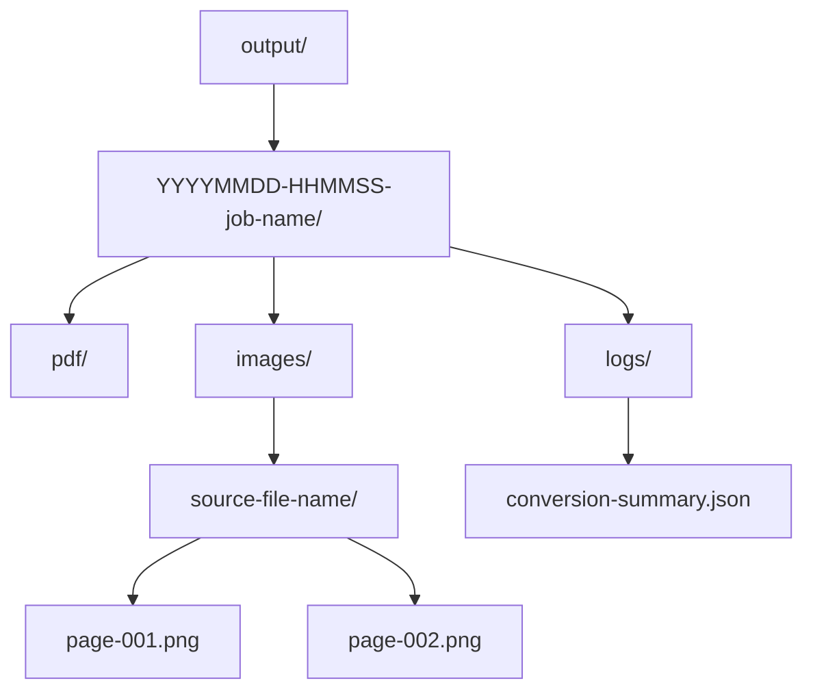

# Architecture Notes

These diagrams show the intended final direction. Phase 2 adds LibreOffice headless document-to-PDF conversion. Phase 2C adds core setup guidance. Phase 3A adds Microsoft Office COM detection and guarded PDF export for local desktop user sessions.

## Phase 2 LibreOffice Engine

Phase 2 code lives in `src/SnappyDocsConvert.Core`. Tests live in `tests/SnappyDocsConvert.Tests` and use fake process runners so LibreOffice is not required for the normal suite.

## Engine Setup Guidance Core

The Office availability provider checks Word and PowerPoint ProgIDs without launching Office.

## Phase 3A Office COM Engine

Office COM conversions are serialized. The engine only quits the COM app instance it created. It is not intended for server/service/unattended automation.

## Final Desktop Architecture

## Engine Selection Flow

## Output Folder Structure

## Future Phase Map

