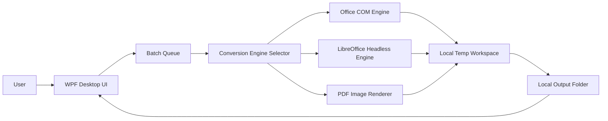
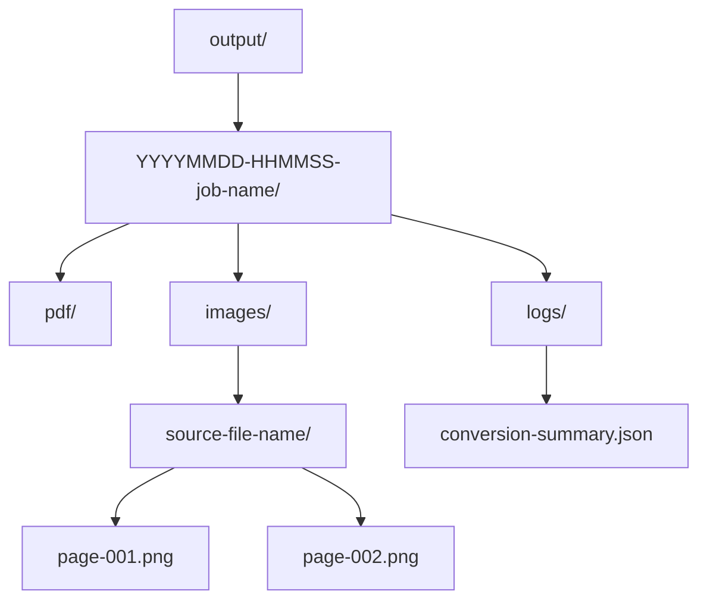

# Architecture Notes

These diagrams show the intended final direction. Phase 0/1 only sets up the local workspace.

## Final Desktop Architecture

## Engine Selection Flow

## Output Folder Structure

## Future Phase Map

